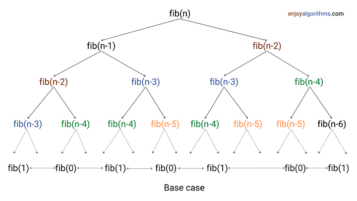

---
layout: post
title:  "turn-recursic"
date:   2024-07-07 19:30:00 +0800
categories: jekyll update
---


> reference:
>  - [top-down-vs-bottom-up-approach-in-dynamic-programming](https://medium.com/enjoy-algorithm/top-down-vs-bottom-up-approach-in-dynamic-programming-53b917bfbe0) 
> - [introduction-to-dynamic-programming](https://www.enjoyalgorithms.com/blog/introduction-to-dynamic-programming)


# 斐波那契数列
## 递归求解
```c++
int fib(int n){
    if(n <= 1)
        return n;
    else
        return fib(n - 1) + fib(n - 2);
}
```
### Time complexity analysis 



从这个调用树可以知道，时间复杂度:

`T(n) = O(2^n)`


## Top-down Approach: 记忆化搜索 
``` c++
Initialize F[n + 1] with -1.
int fib(int n)
{
    if (n <= 1)
        F[n] = n;
    else if (F[n] < 0)
        F[n] = fib(n - 1) + fib(n - 2);
    else
        return F[n];
}
```
### Time complexity analysis 


从这个调用树可以知道，时间复杂度:

`T(n) = O(n)`


## Bottom-up Approach 
``` C++
int fib(int n){
    int F[n + 1];
    F[0] = 0 , F[1] = 1;
    for(int i = 2 ;  i <= n ; i = i + 1)
        F[i] = F[i - 1] + F[i - 2];
    return F[n];
}
```

### Time complexity analysis 


从这个调用树可以知道，时间复杂度:

`T(n) = O(n)`
