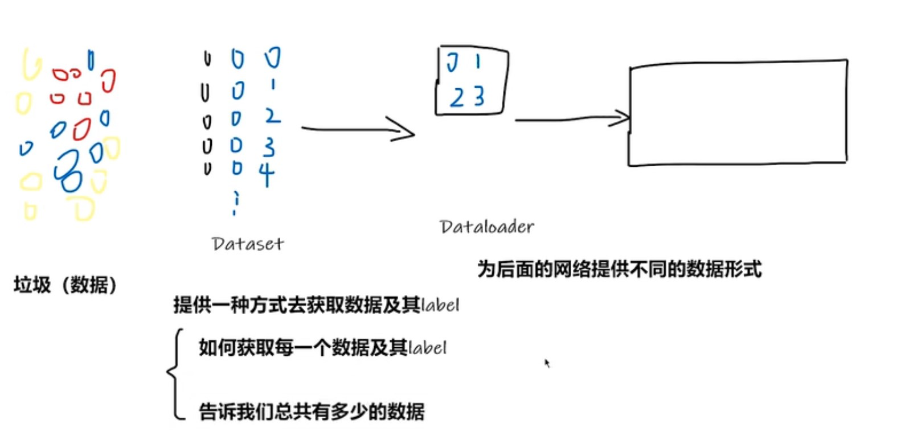

### 介绍



这里用垃圾分类来处理。

Dataset: 提供一种方法把数据加载进来，提供两个方法，分别实现获取数据和label、获取数据总量的功能。

Dataloader: 把数据打包交给模型训练、具体后面再提。

### 代码实战

这里用了一个二分类数据集：ants和bees

```python
from torch.utils.data import Dataset
from PIL import Image
import os

class MyData(Dataset):
  def __init__(self,root_dir,label_dir):
    self.root_dir = root_dir
    self.label_dir = label_dir
    self.path = os.path.join(self.root_dir,self.label_dir)
    self.img_path = os.listdir(self.path)

  def __getitem__(self, idx): # 获取指定索引的样本
    img_name = self.img_path[idx]
    img_item_path = os.path.join(self.root_dir,self.label_dir,img_name)
    img = Image.open(img_item_path)
    label = self.label_dir
    return img,label

  def __len__(self):  # 获取样本总数
    return len(self.img_path)


if __name__ == '__main__':
    root_dir = "data\\train"
    ants_label_dir = "ants"
    bees_label_dir = "bees"
    ants_dataset = MyData(root_dir, ants_label_dir)
    bees_dataset = MyData(root_dir, bees_label_dir)
    train_dataset = ants_dataset + bees_dataset
    print(len(train_dataset))
    img,label = train_dataset[200]
    img.show()

```

​ 包含图片及其label。

